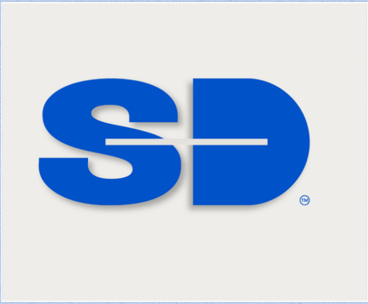
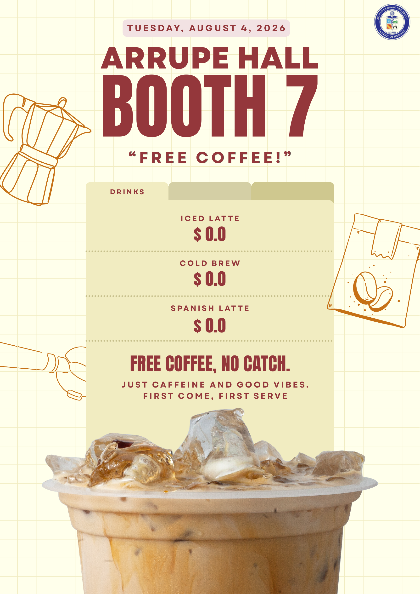
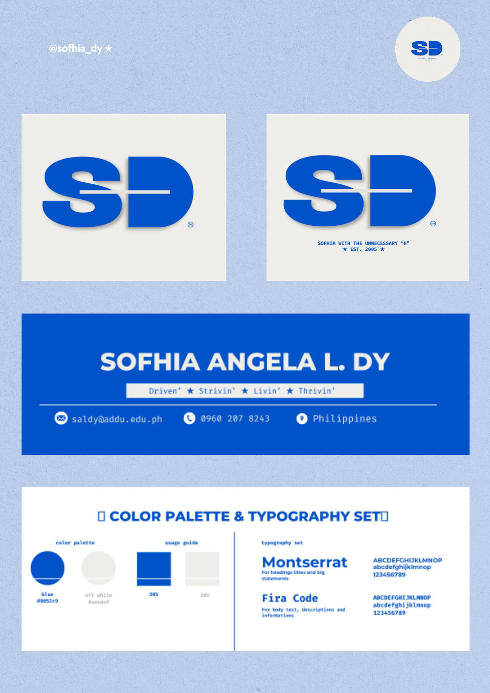
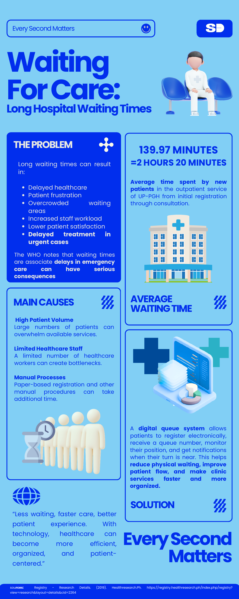

<div align="center">


<br>



</div>

<br>

## 👋 Hey, I'm Sofhia

<div align="center">

[](mailto:saldy@addu.edu.ph)
[](tel:+639602078243)


</div>

**Program:** BSN 4F, Ateneo de Davao University — School of Nursing

<div align="center">

**Tools & Skills Used This Term**


</div>

<br>

<div align="center">
    

<sub>Setup → Design Principles → Branding → Infographic → Prelim Exam</sub>
</div>

<br>

---

## 📸 Portfolio Gallery

<table>
<tr>
<td width="180" valign="top">
<table><tr><td bgcolor="#0052C9">

</td></tr></table>
</td>
<td valign="middle">

**☕ Activity 1 — Presentation Design Principles**
A promotional flyer for a free coffee booth at Arrupe Hall, Booth 7 — built around contrast, hierarchy, whitespace, and imagery so the offer reads in seconds.

</td>
</tr>
<tr>
<td width="180" valign="top">
<table><tr><td bgcolor="#0052C9">

</td></tr></table>
</td>
<td valign="middle">

**🎨 Activity 2 — Color Palette & Typography**
A personal "SD" brand identity in blue and off-white, paired with Montserrat and Fira Code — applied consistently across the logo, business card, and reference sheet.

</td>
</tr>
<tr>
<td width="180" valign="top">
<table><tr><td bgcolor="#0052C9">

</td></tr></table>
</td>
<td valign="middle">

**🩺 Activity 3 — Infographic & Documentation**
*Waiting for Care* visualizes long hospital wait times, paired with a full proposal for MediQueue, an IT-enabled patient queuing system.

</td>
</tr>
</table>

<br>

---


<table>
<tr>
<td width="160" valign="top">
<table><tr><td bgcolor="#0052C9">

</td></tr></table>
</td>
<td valign="top">

**🎨 Color Palette**
🟦 **Blue** `#0052C9` — trust, professionalism, calm
⬜ **Off-White** `#EEEDE9` — softens the palette, keeps it modern

**✍️ Typography**
**Montserrat** — bold & geometric, used for headings and big statements
`Fira Code` — monospace, used for body text; clean and organized

</td>
</tr>
</table>

<br>


```
📁 GE4120-portfolio
 ┣ 📂 sofhia-images/
 ┃    ┣ 🖼️ sd-logo.png
 ┃    ┣ 🖼️ sd-brand-kit.jpg
 ┃    ┣ 🖼️ coffee-flyer.jpg
 ┃    ┗ 🖼️ waiting-for-care-infographic.jpg
 ┣ 📂 activity-1-presentation-design/
 ┣ 📂 activity-2-color-typography/
 ┣ 📂 activity-3-infographic-documentation/
 ┣ 📂 prelim-exam/
 ┃    ┗ 🎥 PRELIM EXAM_DY.mp4
 ┗ 📄 README.md
```

<br>

## 🗂️ Activity Breakdown

> *Straight from my Prelim script — this is exactly how I explain each piece on camera.*

<details open>
<summary><b>1️⃣ Presentation Design Principles</b></summary>
<br>

<table>
<tr>
<td width="200" valign="top">
<table><tr><td bgcolor="#0052C9">

</td></tr></table>
<p align="center"><sub>Free Coffee flyer · Booth 7</sub></p>
</td>
<td valign="top">

**What it is:** A promotional flyer for a free coffee booth, offering iced latte, cold brew, and Spanish latte — completely free, first come first served.

**Design principles applied:**
- 🎯 **Contrast** — bold, dark maroon text against a soft cream background
- 📐 **Visual hierarchy** — "Booth 7" largest (main message), date smallest (context), drink menu in between
- 🌬️ **Whitespace & grid alignment** — subtle background grid, consistent margins
- ☕ **Imagery as focal point** — a large coffee photo anchors the design
- ✏️ **Supporting line-art** — moka pot, coffee beans, coffee sack icons reinforce the theme

</td>
</tr>
</table>

> 💬 *"These choices made the flyer scannable in just a few seconds — someone glancing at it immediately understands what's offered, where, when, and that it's free."*

</details>

<details open>
<summary><b>2️⃣ Color Palette & Typography</b></summary>
<br>

<table>
<tr>
<td width="200" valign="top">
<table><tr><td bgcolor="#0052C9">

</td></tr></table>
<p align="center"><sub>The full "SD" brand sheet</sub></p>
</td>
<td valign="top">

**What it is:** A personal brand identity built around my initials, "SD" — a logo, business card layout, and color/typography reference sheet.

**Color choices:**
- 🟦 **Blue `#0052C9`** — trust, professionalism, calm
- ⬜ **Off-white `#EEEDE9`** — keeps the palette soft and modern

**Typography choices:**
- **Montserrat** — bold, geometric, used for headings and big statements
- **Fira Code** — monospace, clean and technical, used for body text and details

**Consistency:** the same palette and type pairing is applied across the logo, business card, and reference sheet.

</td>
</tr>
</table>

</details>

<details open>
<summary><b>3️⃣ Infographic & Mini Project Documentation</b></summary>
<br>

<table>
<tr>
<td width="200" valign="top">
<table><tr><td bgcolor="#0052C9">

</td></tr></table>
<p align="center"><sub>"Waiting for Care" infographic</sub></p>
</td>
<td valign="top">

**What it is:** An infographic titled *"Waiting for Care: Long Hospital Waiting Times,"* paired with a full project documentation proposing a solution.

**Key data:**
- ⏱️ Average outpatient wait at UP-PGH: **139.97 minutes (≈2 hrs 20 min)**
- 🌍 WHO notes delays in emergency care can have serious consequences

**Main causes:** high patient volume · limited healthcare staff · manual, paper-based processes

</td>
</tr>
</table>

**The proposed solution — MediQueue**, an IT-enabled patient queuing and scheduling system:
- 📲 Online booking portal + QR-code check-in
- ⚖️ Smart scheduling & load-balancing, prioritizing urgent cases
- 🖥️ Centralized queue management dashboard for staff
- 🔔 Real-time SMS/app notifications
- 📊 Analytics module tracking wait times and peak-hour patterns

**Grounded in research:** cites Zhang et al. (2023) on the link between waiting time and patient satisfaction, and WHO guidance on quality health services.

</details>

<br>


A recorded 5–8 minute walkthrough of this repo and all three activities, closing with a reflection on the question: *"What is the importance of Presentation Design?"*

> 💭 *"Presentation design isn't just about making things look nice — it's about how effectively an idea gets communicated. It guides attention, improves understanding, builds credibility, and creates a more engaging, memorable experience."*
> — from my Prelim script, wrap-up section

<div align="center">

📽️ **[▶ Watch PRELIM EXAM_DY.mp4](prelim-exam/PRELIM%20EXAM_DY.mp4)**

</div>

<br>

<details>
<summary>🎁 <b>Psst — one more thing (click to open)</b></summary>
<br>

You made it to the bottom of the README! Here's a small bonus: this whole page — colors, fonts, layout, even the framed photo gallery — follows the *exact same design principles* explained in Activity 1: contrast to catch your eye, hierarchy to guide you section by section, and consistent branding so it all feels like one thing instead of scattered files.

In other words — **this README is technically a fourth activity.** 😄

</details>

<br>


<div align="center"><sub>© 2026 Sofhia Angela L. Dy · GE 4120 Portfolio</sub></div>
