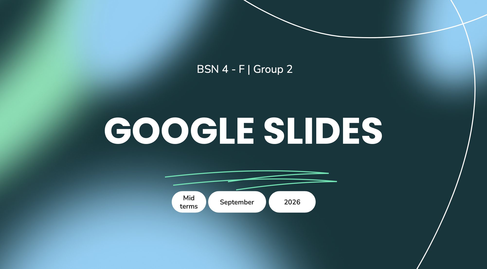
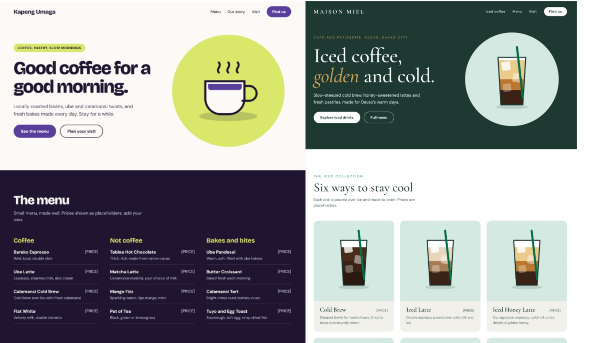

 

 

 

 

# ✦ WELCOME TO MY DIGITAL PORTFOLIO ✦

**A collection of creativity, design, digital skills, ideas, and learning experiences.**

 

 

This digital portfolio showcases my work, activities, projects, and learning experiences in **GE 4120 – 21st Century IT Skills**. Throughout the course, I explored how technology, creativity, communication, and digital tools can come together to create meaningful and engaging outputs.

From presentation design and branding to digital projects, documentation, and AI-assisted work, each activity was an opportunity to sharpen my skills, explore ideas, and improve how I communicate visually and digitally.

 

| 🎨 **7** | 🖌️ **2** | 🤖 **2** | 🎓 **1** |
|:---:|:---:|:---:|:---:|
| Activities | Brand Colors | AI Tools Compared | Course |
| *designed & documented* | *Blue · Off-White* | *ChatGPT · Claude* | *GE 4120* |

 

---

 

## ✦ 01 · ABOUT ME ✦

Hi! I'm **Sofhia Angela L. Dy**, a Nursing student of **Ateneo de Davao University** (BSN 4F).

I enjoy exploring creative ideas, learning new digital tools, and turning concepts into visually appealing and meaningful outputs. This portfolio documents my growth in using technology for creativity, communication, productivity, and innovation.

> *"Technology is not only about knowing how to use tools. It is about understanding how to use them with purpose."*

**✧ A little about me**

- 🎓 &nbsp;Student of Ateneo de Davao University
- 💻 &nbsp;Exploring digital technology and IT skills
- 🎨 &nbsp;Interested in creativity, design, branding, and visual communication
- ✨ &nbsp;Learning how to use digital tools more effectively
- 🧠 &nbsp;Open to new ideas, challenges, and learning experiences

 

 

---

 

## ✦ 02 · MY ACTIVITIES ✦

*Seven activities, seven ways of learning.*

 

| № | ACTIVITY | WHAT I DID | OUTPUT |
|:---:|:---|:---|:---:|
| **01** | ☕ **Presentation Design Principles** | Promotional flyer focusing on visual hierarchy, contrast, composition, and communication. | [**View →**](./Activity-1/README.md) |
| **02** | 🎨 **Color Palette & Typography** | A personal brand identity built on color, typography, and visual consistency. | [**View →**](./Activity-2/README.md) |
| **03** | 🩺 **Infographic & Project Documentation** | Visual communication of hospital waiting-time issues and the proposed MediQueue system. | [**View →**](./Activity-3/README.md) |
| **04** | 📂 **Preliminary Examination** | Compilation of work, digital outputs, and examination-related portfolio material. | [**View →**](./Activity-4/README.md) |
| **05** | 🧁 **Kapeng Umaga vs. Maison Miel** | A comparative creative and digital design project. | [**View →**](./Activity-5/README.md) |
| **06** | 👜 **Likha Leather Works** | A digital business, design, and creative project. | [**View →**](./Activity-6/README.md) |
| **07** | 🤖 **Comparative Resume Generation Using Multiple LLMs** | Comparing AI-generated resumes across different AI platforms. | [**View →**](./Activity-7/README.md) |

 

---

 

## ✦ 03 · PORTFOLIO GALLERY ✦

*A visual look at my work.*

 

<table>
<tr>
<td align="center" width="50%" valign="top">

**☕ Presentation Design Principles**

Contrast · Hierarchy · Imagery · Layout

[View Activity →](./Activity-1/README.md)

</td>
<td align="center" width="50%" valign="top">

**🎨 Color Palette & Typography**

Logo · Color · Type · Consistency

[View Activity →](./Activity-2/README.md)

</td>
</tr>

<tr>
<td align="center" width="50%" valign="top">

**🩺 Infographic & Documentation**

Waiting for Care · MediQueue

[View Activity →](./Activity-3/README.md)

</td>
<td align="center" width="50%" valign="top">

**📂 Preliminary Examination**

Digital portfolio & exam output

[View Activity →](./Activity-4/README.md)

</td>
</tr>

<tr>
<td align="center" width="50%" valign="top">

**🧁 Kapeng Umaga vs. Maison Miel**

Creative comparison & design

[View Activity →](./Activity-5/README.md)

</td>
<td align="center" width="50%" valign="top">

**👜 Likha Leather Works**

Business & digital concept

[View Activity →](./Activity-6/README.md)

</td>
</tr>

<tr>
<td align="center" width="50%" valign="top">

**🤖 Resume Generation Using LLMs**

ChatGPT vs. Claude

[View Activity →](./Activity-7/README.md)

</td>
<td align="center" width="50%" valign="top">

**✨ Learning, Creating, Exploring**

My digital journey

</td>
</tr>
</table>

 

---

 

## ✦ 04 · ACTIVITY DETAILS ✦

*Tap an activity to open it.*

 

<b>☕ &nbsp;ACTIVITY 01 — PRESENTATION DESIGN PRINCIPLES</b>

 

**Overview**

Applied core presentation design principles through a promotional flyer for a free coffee booth at **Arrupe Hall, Booth 7**, communicating information quickly while staying visually engaging.

**Design Principles Applied**

| Principle | How it was used |
|:---|:---|
| **Contrast** | Making important text stand out from the background |
| **Visual Hierarchy** | Prioritizing the main message over supporting details |
| **Whitespace** | Giving the layout room to breathe |
| **Alignment** | Keeping the composition organized and balanced |
| **Imagery** | Using visuals to reinforce the message |
| **Typography** | Choosing fonts for readability and tone |

> 💭 **Takeaway:** Good design is more than decoration. It organizes information and guides the viewer to the most important message.

<a href="#">↑ back to top</a>

<b>🎨 &nbsp;ACTIVITY 02 — COLOR PALETTE & TYPOGRAPHY</b>

 

**Overview**

Created a personal brand identity from my initials, **SD**, including a logo, business card, color palette, and typography reference.

**Brand Colors**

| Color | Hex | Meaning |
|:---|:---:|:---|
| 🟦 Blue | `#0052C9` | Trust, professionalism, confidence |
| ⬜ Off-White | `#EEEDE9` | Simplicity, softness, modern aesthetic |

**Typography**

- **Montserrat** – bold and geometric, suited for headings
- **Fira Code** – clean, technical, and distinctive

> 💭 **Takeaway:** Color, typography, and consistency work together to build a recognizable identity.

<a href="#">↑ back to top</a>

<b>🩺 &nbsp;ACTIVITY 03 — INFOGRAPHIC & PROJECT DOCUMENTATION</b>

 

**Overview**

Used an infographic, **Waiting for Care**, to communicate the problem of long hospital waiting times and the need for more efficient patient management.

**Proposed IT Solution: MediQueue**

A digital patient queuing and scheduling system designed to improve patient flow and support efficient hospital operations.

| | Feature |
|:---:|:---|
| 📅 | Online booking and scheduling |
| 📱 | QR-code check-in |
| 👀 | Patient queue monitoring |
| 🔔 | Real-time notifications |
| 🖥️ | Centralized dashboard |
| 📊 | Data analytics for patient flow |

> 💭 **Takeaway:** Technology can address real-world problems, and this activity combined research, information design, and documentation.

<a href="#">↑ back to top</a>

<b>📂 &nbsp;ACTIVITY 04 — PRELIMINARY EXAMINATION</b>

 

**Overview**

My preliminary examination work and the digital outputs developed throughout the course.

> 💭 **Takeaway:** It helped me consolidate the concepts, skills, and creative approaches I explored during the preliminary period.

<a href="#">↑ back to top</a>

<b>🧁 &nbsp;ACTIVITY 05 — KAPENG UMAGA VS. MAISON MIEL</b>

 

**Overview**

A creative comparison between Kapeng Umaga and Maison Miel, highlighting visual presentation, creative direction, and digital design.

> 💭 **Takeaway:** Different visual approaches change how audiences perceive a brand or concept.

<a href="#">↑ back to top</a>

<b>👜 &nbsp;ACTIVITY 06 — LIKHA LEATHER WORKS</b>

 

**Overview**

Creative and digital development of a business concept, Likha Leather Works.

> 💭 **Takeaway:** Digital tools and creative design can strengthen business presentation, branding, and communication.

<a href="#">↑ back to top</a>

<b>🤖 &nbsp;ACTIVITY 07 — COMPARATIVE RESUME GENERATION USING MULTIPLE LLMs</b>

 

**Overview**

Compared resumes generated by different AI platforms from the same information, looking at how each tool structures and presents a professional resume.

**Comparison Focus**

| Criteria | What was evaluated |
|:---|:---|
| Structure & Organization | How sections are arranged and prioritized |
| Formatting | Layout consistency and visual polish |
| Readability | Ease of scanning and reading |
| Content Clarity | Accuracy and precision of wording |
| Professional Presentation | Overall impression and credibility |
| Suitability | Fit for the intended position |

**AI Tools Compared:** &nbsp;`ChatGPT` &nbsp;·&nbsp; `Claude`

> 💭 **Takeaway:** AI can boost productivity and content development, but its output still needs human evaluation, editing, and refinement.

<a href="#">↑ back to top</a>

 

---

 

## ✦ 05 · MY BRAND IDENTITY ✦

*Blue for trust. Off-white for simplicity.*

 

  

  

<table>
<tr>
<td align="center">

**Blue** `#0052C9`

</td>
<td align="center">

**Off-White** `#EEEDE9`

</td>
</tr>
</table>

 

| FONT | PURPOSE |
|:---:|:---:|
| **Montserrat** | Headings & emphasis |
| `Fira Code` | Technical & supporting text |

 

---

 

## ✦ 06 · TOOLS & DIGITAL SKILLS ✦

 

 

| AREA | SKILLS DEVELOPED |
|:---:|:---|
| 🎨 **Design** | Presentation design · Visual organization · Branding fundamentals · Typography |
| 💬 **Communication** | Digital communication · Information presentation · Infographics |
| 💻 **Technology** | AI-assisted content development · GitHub & Markdown · Digital portfolio management |
| 🌱 **Mindset** | Creative thinking · Project documentation · Adaptability |

 

---

 

## ✦ 07 · REFLECTION ✦

Throughout GE 4120, I discovered how digital tools can be used not only to complete academic requirements but also to express creativity, organize ideas, and solve problems.

Each activity introduced a different opportunity to explore design, technology, communication, and innovation. I learned that digital skills require continuous practice, creativity, and adaptability.

This portfolio represents more than a collection of outputs. It reflects my learning process, my willingness to explore unfamiliar tools, and my development as a student in an increasingly digital world.

I look forward to applying what I have learned to future academic and personal projects.

 

 

### ✦ DRIVEN · STRIVIN · LIVIN · THRIVIN ✦

*Creativity is not just what you make. It is how you think, communicate, and transform ideas into something meaningful.*

 

 

**GE 4120 &nbsp;|&nbsp; 21st Century IT Skills**

Ateneo de Davao University

© 2026 Sofhia Angela L. Dy · Digital Portfolio

